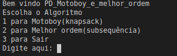
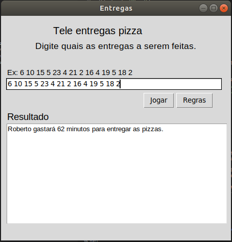

Temas:
 - PD
 
 **!! *Não coloque os nomes dos alunos no título do repositório*. Exemplo de título correto: Grafos2_Labirinto-do-Minotauro !!**
 
 (Apague essa seção)

# Motoboy e

**Conteúdo da Disciplina**: D&C 

## Alunos
|Matrícula | Aluno |
| -- | -- |
| 17/0080366  |  Moacir Mascarenha |
| 15/0062567  |  Marcos Adriano Nery de Abrantes|

## Sobre 

### Problema

O projeto consiste em utilizar os conceitos dos algoritmos, de programação dinamica, apresentados na matéria(projeto de algoritmos) para solucionar problemas do [URI](www.urionlinejudge.com.br).

- [Motoboy](https://www.urionlinejudge.com.br/judge/en/problems/view/1286)

Joseph é um motociclista que trabalha fazendo entregas para uma pizzaria. Seu salário é baseado no número de pizzas entregues. Como esta pizzaria está crescendo ele pediu ao amigo Roberto para ajudá-lo nas entregas. Como Roberto não está trabalhando no momento, ele concordou em receber os piores pedidos (cujas entregas serão mais demoradas).
    A aplicação encontra quais os pedidos que o motoboy temporario deve entregar.

## Screenshots

### Menu

### Jogo Bolhas e Balde

### Jogo do Tijolo

## Instalação 
**Linguagem**: Python 

#### Requisitos

- python3 instalado
- Biblioteca tkinter instalada
    
        pip install tkinter

## Uso 

[Instruções em video]( )

### Rodar a Aplicação

    1° Entre na pasta src
    2° Execute: python3 main.py
        3° Escolha o jogo(1-Bolhas e Baldes ou 2-Jogo do Tijolo)
            Motoboy:
                1° Aguarde a janela carregar
                2° Adicione a sequencia de numeros conforme as regras
                3° Precione o botão "Jogar"
            Jogo do Tijolo:
                1° Aguarde a janela carregar
                2° Adicione o numero dos jogadores
                3° Precione o botão "Buscar"

## Referências

> Algoritmo de solução de troco. Disponivel em: http://prorum.com/?qa=3250/problema-troco-resolve-abordagem-natural-sempre-funciona
 
> Desafio Motoboy. Disponivel em: https://www.urionlinejudge.com.br/judge/en/problems/view/1286