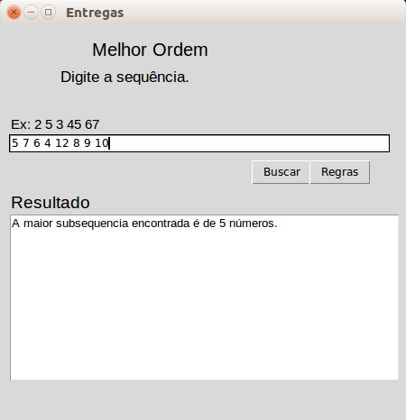

Temas:
 - PD

# Motoboy e Melhor ordem

**Conteúdo da Disciplina**: Programação Dinâmica

## Alunos
|Matrícula | Aluno |
| -- | -- |
| 17/0080366  |  Moacir Mascarenha |
| 15/0062567  |  Marcos Adriano Nery |

## Sobre 

### Problema

O projeto consiste em utilizar os conceitos dos algoritmos, de programação dinamica, apresentados na matéria(projeto de algoritmos) para solucionar problemas do [URI](www.urionlinejudge.com.br).

- [Motoboy](https://www.urionlinejudge.com.br/judge/en/problems/view/1286) - Knapsack

Joseph é um motociclista que trabalha fazendo entregas para uma pizzaria. Seu salário é baseado no número de pizzas entregues. Como esta pizzaria está crescendo ele pediu ao amigo Roberto para ajudá-lo nas entregas. Como Roberto não está trabalhando no momento, ele concordou em receber os piores pedidos (cujas entregas serão mais demoradas).
    A aplicação encontra quais os pedidos que o motoboy temporario deve entregar.

- [Melhor Ordem](https://www.urionlinejudge.com.br/judge/pt/problems/view/2919) - Maior Subsequência

O colégio de Nlognônia descobriu que você irá participar de uma maratona de programação então pediram a sua ajuda na nova brincadeira que eles inventaram. Será dado a você uma lista com N números inteiros e distinto. Há algumas restrições, você terá que percorrer da esquerda para a direita e cada vez que você desejar inserir um novo elemento na lista o elemento que você está inserindo tem que ser maior do que todos elementos que você já inseriu até o momento. O tamanho dessa lista deve ser maximizado. É permitido percorrer está lista uma vez e ela deve ficar em ordem crescente.

## Screenshots

### Menu

### Motoboy

### Melhor Ordem

## Instalação 
**Linguagem**: Python 

#### Requisitos

- python3 instalado
- Biblioteca tkinter instalada
    
        pip install tkinter

## Uso 

[Instruções em video](https://www.dropbox.com/s/vehsv3k0opfx4o2/proj_alg%20on%202020-12-04%2023-23.mp4?dl=0)

### Rodar a Aplicação

        1° Entre na pasta src
        2° Execute: python3 main.py
                3° Escolha o jogo(1-Motoboy ou 2-Melhor ordem)
                Motoboy:
                        1° Aguarde a janela carregar
                        2° Adicione a sequência de numeros conforme as regras
                        3° Precione o botão "Jogar"
                Melhor ordem:
                        1° Aguarde a janela carregar
                        2° Adicione a sequência de números
                        3° Precione o botão "Buscar"

## Referências

> Algoritmo de solução de troco. Disponivel em: http://prorum.com/?qa=3250/problema-troco-resolve-abordagem-natural-sempre-funciona
 
> Desafio Motoboy. Disponivel em: https://www.urionlinejudge.com.br/judge/en/problems/view/

> Melhor Ordem. Disponível em: https://www.urionlinejudge.com.br/judge/pt/problems/view/2919

> Read lines containing integers from a file in Python?. Disponível em: https://stackoverflow.com/questions/11354544/read-lines-containing-integers-from-a-file-in-python

> Python 3 - File readlines() Method. Disponível em: https://www.tutorialspoint.com/python3/file_readlines.htm

> Longest Increasing Subsequence | DP-3. Disponível em: https://www.geeksforgeeks.org/longest-increasing-subsequence-dp-3/
